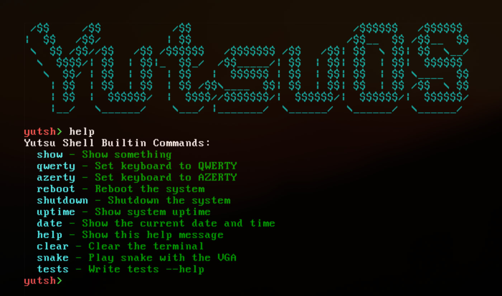

<h1 align="center">
  YutsuOS - EPITECH PROJECT 2025<br>
  
  <br>
</h1>

<div align="center">
  <p></p>
  <div align="center">
     <a href="https://github.com/Leorevoir/YutsuOS/stargazers">
        
     </a>
     <a href="https://github.com/Leorevoir/YutsuOS/">
        
     </a>
     <a href="https://github.com/Leorevoir/YutsuOS/blob/main/LICENSE">
        
     </a>
  </div>
  <br>
</div>

<p align="center">
  YutsuOS<br>
  a working x86-32 Kernel from Scratch
</p>

---

## Description

YutsuOS was a project I made during my 3rd year at EPITECH. The goal was to discover the **real** kernel-level programming.



## Installation

Ensure you have the right dependencies:

```bash
cmake
gcc
ninja
nasm
qemu-system-x86
grub-pc-bin
grub-common
```

Build the project:

```bash
./build.sh
```

Run the OS in a Virtual Machine:

```bash
./build.sh --run
```

## Tested on

- EndeavourOS
- Arch Linux
- Ubuntu

---

## Documentation

See [**DOCUMENTATION**](../docs/README.md)

## License

Project developed as part of the G-PRO-500 module at EPITECH.
See [**LICENSE**](./LICENSE).
